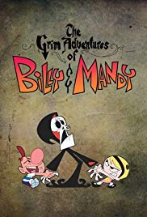
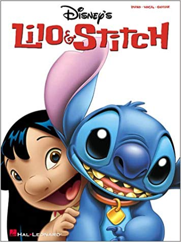
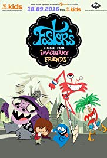

# Free-For-all

My project is about my top 5 favorite cartoons from when I was a kid From each major channel cartoon network, Nickoloadean, and Disney channel. I will only use shows from the 2000's that I have seen and this is just my opinon about the show.

# **Cartoon Network**
* *The Grim Adventures Of Billy and Mandy*
* *Foster's Home for Imaginary Friends*
* *CodeName: KidsNextDoor*
* *Ed Edd n'Eddy*
* *Chowder*

# **Disney Channel**
* *Lilo & Stitch
* *Recess
* *Proud Familiy
* *Kid vs Kat
* *American Dragon: Jake Long 

# **Nickoloadean**
* *Invader Zim*
* *Avatar: The Last Airbender*
* *Rugrats*
* *ChalkZone*
* *Fairly Odd Parents*

# My Favorite From All Networks
1.**The Grim Adventures Of Billy and Mandy*

https://www.imdb.com/title/tt0292800/

2.**Invader Zim*

[https://www.imdb.com/title/tt0235923/]

3.**Avatar: The Last Airbender*

[https://www.imdb.com/title/tt0417299/]

4.**Lilo & Stitch*

[https://www.imdb.com/title/tt0364774/]

5.**Foster's Home for Imaginary Friends*

[https://www.imdb.com/title/tt0419326/]

